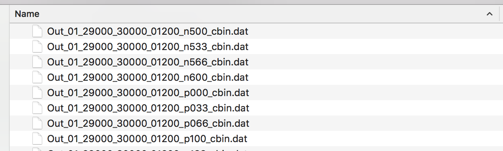
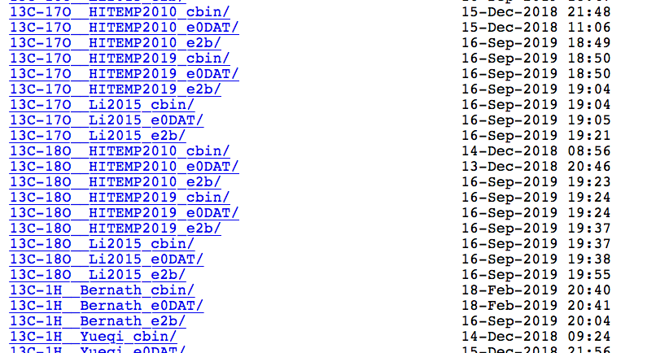

k-Table Generator
=================

This script called the "k-Table Generator" is a tool that converts HELIOS-K output opacity files into a combined opacity table, which can be used in by HELIOS. 

To combine the individual opacities one can either set a constant volume mixing ratio for each species. Or one can read in pre-calculated equilibrium abundances using the FastChem code (see :doc:`software`). Pre-tabulated HELIOS-K opacities may be found `here <https://chaldene.unibe.ch/data/Opacity3/>`_. Data in the directories marked with the suffix "_e2b" should be used.

Getting Started
---------------

The program is run by typing::

	python3 ktable.dat

in the ``ktable`` directory. Additional source files are located in the source subdirectory, and additional input files in the input directory. The output goes per default to the output subdirectory. Note, every path can be modified in the parameter file ``param_ktable.dat``. Further parameters are described below.

**Main idea**

The opacity table generation comes in *two stages*. In the first stage, one opacity container is individually created for each species from the HELIOS-K output. In the second stage, the individual opacities are weighted by the respective molecule's mixing ratio and combined to the final mixed opacity table. This final mixed opacity table can be then used in HELIOS.

Parameter File and Input
------------------------

The parameter file ``param_ktable.dat`` contains the parameters for the correct reading and writing of the opacities. The parameters are as follows.

``format (ktable, sampling)``

This determines the type of the opacity tables you want to generate. Either k-distribution tables (ktable) or opacity sampling tables (=simple per-wavelength opacities) can be used in HELIOS. The "ktable" option more accurate, but appear very low resolution with coarse wavelength bins. The sampling method is slightly less accurate and usually used to post-process spectra at a high resolution. Using sampling is more straightforward so I recommend using the sampling method for the lowest effort. 

``individual species calculation (yes, no)``

Sets whether the files for individual molecules need to be calculated (aka the first stage of the process). If starting from the HELIOS-K output, this should be set to "yes". If the individual files have already been generated previously and you want to directly start with combining the species (e.g., to choose different chemical abundances than before), set this to "no".

``path to HELIOS-K output``

Sets the path to the HELIOS-K output directory. This directory should include all the opacity files in the ''cbin'' Helios-K format. (The files can be in subdirectories.) This parameter is **only considered in the ktable setting**.

``path to sampling species file``

Sets the path to the file which lists all the species and their respective paths for the sampling calculation. This is usually located somewhere in the main HELIOS-K output directory. The first column is the name of the species. In theory the name can be chosen freely, but it is recommended to choose the usual chemistry notation. Also, the name of the files is used later on again to pick the correct files for each species. This parameter is **only considered in the ''sampling'' setting**.

``HELIOS-K output format (binary, text)``

Sets the format of the HELIOS-K output files. Possible are either binary files or text/ASCII files. Usually, the pre-calculated output of HELIOS-K comes in binary format. If using HELIOS-K yourself, the files will most probably be text files. If you are not sure, simply look at the ending of the HELIOS-K output files. Is it ``.bin`` (= binary) or ``.dat`` (= text)?

``sampling wavelength grid (resolution, limits in micron [lower, upper])``

Sets the wavelength grid to be used for the opacity sampling process. Three numbers specify the grid. The first number sets the sampling resolution in wavelength. The second and third numbers give the lower and upper wavelength limits in micron, respectively. Usually I use something around "R=3000" with a lower limit at 0.34 micron and a upper limit at 200 micron.

``directory with individual files``

This directory will be created and the files generated in Stage 1 will be put into here.

``path to final species file``

Sets the path to the file, which contains all the species to be included in the final mixed table. The format of this file is explained further below.

``path to FastChem output``

Sets the path to the FastChem output. This setting is optional and only needed if FastChem is used to pre-calculate the equilibrium abundances of the species. In the current version the output needs to come in two files named ``chem_high.dat`` and ``chem_low.dat``, containing the chemical abundance for a temperature pressure grid, whereas the first file contains the higher temperature regime and the second one the lower temperatures. The grid structure [p + n_p * t] is used. Check out the example file included in the input/chemistry subdirectory for reference. (This will be made more user-friendly in a future update.) As example, I use a grid in P=[1e-6,1e3,Delta_P=1/3dex] and T=[100, 6000, Delta_T=50] for my own calculations.

``final output (mixed table) directory``

Sets the path to the final mixed opacity table and corresponding temporary and info files.

Note: Many temporary files are being generated to save intermediate calculations, e.g., interpolated opacity files (files with an "ip" in their name). This allows for a speed-up the next time the same species are used for a calculation. These temporary files can be safely deleted, should they use up too much storage space.

**EXPERIMENTAL / DANGER ZONE**

There are experimental options, which are under testing for functionality. For the moment these parameters should be left alone. *Beware of the danger zone!*

Sample Files for Reference
--------------------------

The installation comes with reference examples for all the required input files.

final species file
------------------

The format for this file is as follows (see also figure). Each species can be listed individually in no particular order. The listed name has to match the name of the individual opacity files. For absorbing species (species that possess opacity files) the "absorbing" option should be set to "yes". If Rayleigh scattering cross-sections for a given species should be included, "scattering" has to be set to "yes". At the moment the following Rayleigh cross-sections are included (plus references):

* H2: Cox 2000
* He: Sneep & Ubachs 2005, Thalman et al. 2014
* H: Lee & Kim 2004
* H2O: Murphy 1977, Wagner & Kretzschmar 2008
* CO: Sneep & Ubachs 2005
* CO2: Sneep & Ubachs 2005, Thalman et al. 2014
* O2: Sneep & Ubachs 2005, Thalman et al. 2014
* N2: Sneep & Ubachs 2005, Thalman et al. 2014

Next, we set the volume mixing ratio. They can be either read in from FastChem output files (set "FastChem") or be given as numbers explicitely (same column). If FastChem is used the next column is important as it sets the name of this molecule as defined in FastChem. For constant mixing ratios this column can be ignored. Lastly, the mass for each species is needed in order to allow the code to convert between volume and mass mixing ratios.

Special are CIA opacities. They work as any other species, but require two entries for the mixing ratio (if given as number) and two entries for the Fastchem name separated by a "&". For the mass, the value of the *second* collision partner should be used. E.g., for CIA H2-He this is the mass of He, for CIA O2-N2 this would be the mass of N2, etc.

.. figure:: ../figures/sample_final_species.png
   :scale: 70 %
   :alt: map to buried treasure

   *Figure: final species file format*

ktable vs sampling
------------------

**ktable**

If the first parameter in ``param_ktable.dat`` is set to "ktable", the program will calculate the k-distribution tables for the individual species, using the Chebyshev coefficients from the HELIOS-K output. For this it needs to access the "cbin" files containing the Chebyshev coefficients. It will generature individual opacity containers with 20 Gaussian points per wavelength bin. This is required in HELIOS. The number of wavelength bins is given by the resolution of the "cbin" files. See the HELIOS-K ReadMe for more info on those. The species considered in this process are simply the species present in the directory (or subdirectories) set in the parameter file.

   *Figure: cbin files produced by HELIOS-K.*

**sampling**

If the first parameter in ``param_ktable.dat`` is set to "sampling", the program will sample the opacity output from HELIOS-K at the wavelength grid, as specified in the ``param_ktable.dat`` file and convert it into individual molecular opacity files. The species to be sampled and where to find them is set the "sampling species file".

   *Figure: Directory with pre-calculated opacity files from HELIOS-K. This is a good input for the opacity table generation using the ''sampling'' method. The ''_e2b'' directories should be used for any species.*